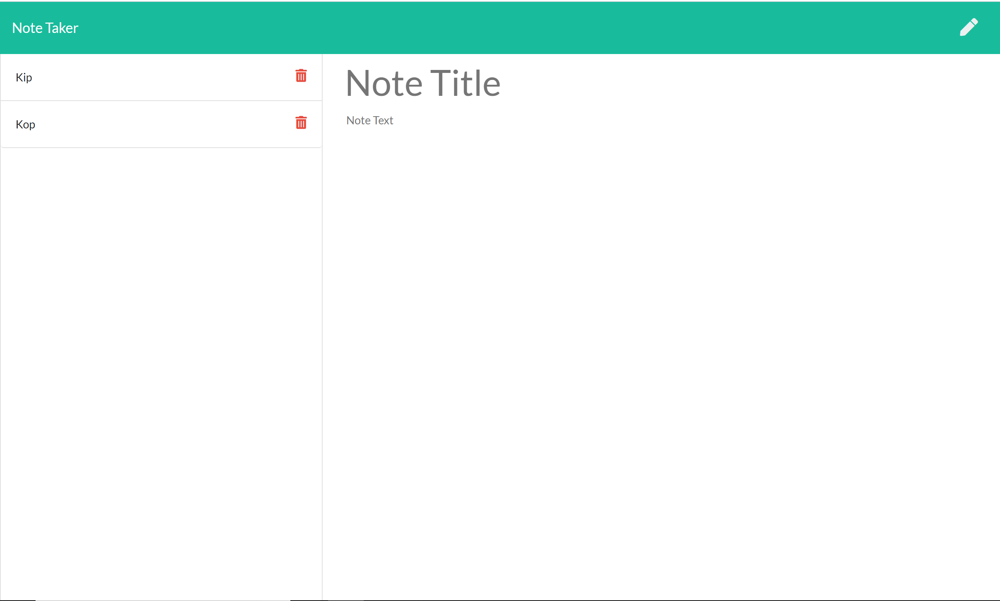

# Unit 11 Express Homework: Note Taker

## URL
https://powerful-plateau-81231.herokuapp.com/

## Description
This application takes advantage of routes and an API to generate notes that the user types into the boxes. 

## Usage
Two areas for the user to enter text, and the user can then save them. The notes populate a pane on the lest side, with the option to delete them if desired. 

## Technologies Used

* Javascript
* Heroku
* Bootstrap
* NPM Packages:
    - express

## Role in development

Sole developer of application

